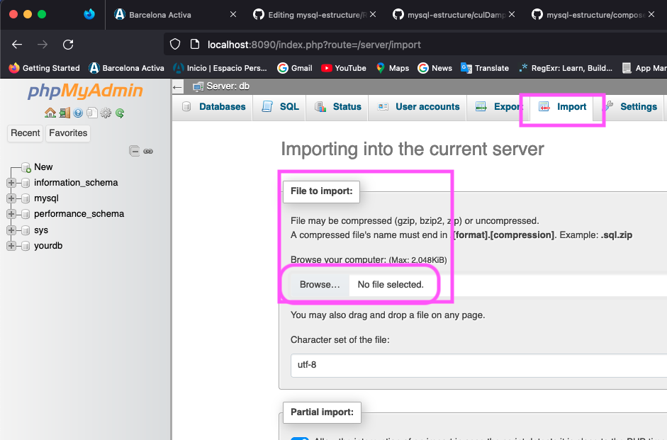

# Sql query usages
Project to test different querys on SQL databases

### Pre-requisites: __Docker or XAMPP__

## Docker
> link to download: https://docs.docker.com/get-docker/
1. If you have docker run the followed command to start a container with mysql and phpmyadmin:
   
```bash
docker compose up -d
```

navigate to http://localhost:8090/
> username: root
> 
> password: password


## XAMPP 
  
> Link to download: https://www.apachefriends.org/download.html

After downloading and installing XAMPP, open the XAMPP control panel and start the Apache and MySQL modules.
<div align="center">

</div>

Go to [phpMyAdmin](http://localhost/phpmyadmin/sql.php)


## Usage

Each folder in this project is a database with its own design, and a file with its name to create the database in sql Language.

i.e -> ``schema_universidad.sql`` is the file to create the database ``universidad``

got to the import tab in phpMyAdmin and select the file to import.
<div align="center">

</div>
Copy the whole content of the file and paste it in the SQL tab in phpMyAdmin.
This will create the database with its tables and relations and insert mock data to test the querys.

After creating you can execute the necessary queries to test the database.

